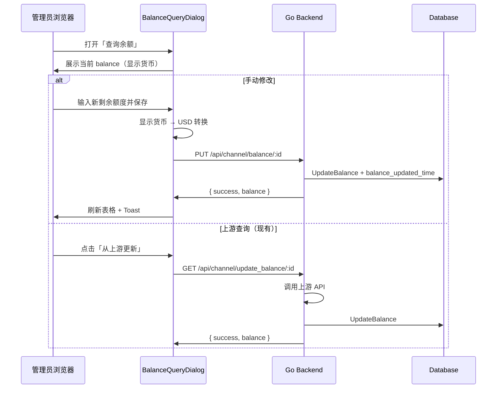

# 渠道管理 — 剩余额度手动修改功能 · 产品需求文档（PRD）

> **状态**：待确认 · **范围**：`web/default` 渠道管理页 + 后端 API  
> **说明**：本文档基于当前代码库现状编写，确认后再进入开发。

---

## 1. Executive Summary

### Problem Statement

渠道管理页「已用 / 剩余」列中，**剩余额度**（对应字段 `balance`，单位 USD）目前仅支持**从上游 API 拉取更新**（点击 Badge 或「查询余额」对话框中的「更新余额」）。当上游不支持余额查询、查询失败，或管理员需按实际充值/对账结果校正本地记录时，**无法手动修改剩余额度**。

Classic 主题 i18n 中已有文案键 `请输入新的剩余额度`，但**全项目无任何引用**，说明该能力曾规划但未落地。

### Proposed Solution

在 Default 主题渠道管理页增加**管理员手动设置渠道剩余额度**能力：扩展现有「查询余额」对话框，增加手动编辑区；后端新增专用 API，写入 `balance` 并更新 `balance_updated_time`，与上游查询逻辑分离。

### Success Criteria

| KPI | 目标 |
|-----|------|
| 功能可用性 | 管理员可在 3 次点击内完成单渠道剩余额度修改（行菜单 → 查询余额 → 保存） |
| 数据一致性 | 保存后表格剩余额度在 1 秒内刷新，与数据库 `balance` 一致 |
| 权限安全 | 非 Admin 用户无法调用修改接口（沿用 `/api/channel` 的 `AdminAuth`） |
| 交互不回归 | 现有「从上游查询余额」功能保持可用，行为不变 |
| 输入正确性 | 用户按当前系统货币配置（CNY/USD/Tokens 等）输入，后端始终以 USD 存储 |

---

## 2. User Experience & Functionality

### User Personas

- **系统管理员**：管理上游渠道，需维护渠道余额记录，用于低余额告警、自动禁用等运维判断。

### 现状梳理

| 维度 | 当前实现 |
|------|----------|
| 数据模型 | `balance`（float64，USD）；`used_quota`（int，内部额度单位）；`balance_updated_time` |
| 表格列 | `BalanceCell`：已用 = `used_quota`，剩余 = `balance` |
| 点击剩余 Badge | 调用 `GET /api/channel/update_balance/:id`，从上游拉取（Codex type=57 除外） |
| 行菜单 | 「Query Balance」→ `BalanceQueryDialog`，仅展示 + 上游更新按钮 |
| 后端写入 | `model.Channel.UpdateBalance(balance)` 存在，但仅被上游查询流程调用 |
| Tag 聚合行 | 只展示累计已用，不可操作（保持不变） |

### User Stories

**Story 1 — 手动修改剩余额度**

> As a **管理员**，I want to **在渠道管理页手动设置某渠道的剩余额度**，so that **在无法或无需从上游查询时，仍能维护准确的本地余额记录**。

**Acceptance Criteria：**

- [ ] 在「查询余额」对话框中增加「手动修改剩余额度」区域
- [ ] 输入框预填当前剩余额度（按系统货币配置展示，如 CNY / Tokens）
- [ ] 支持输入 ≥ 0 的数值；提交前做前端校验
- [ ] 保存成功后 Toast 提示，对话框内余额与表格列同步更新
- [ ] 保存后 `balance_updated_time` 更新为当前时间
- [ ] 复用已有 i18n 键 `请输入新的剩余额度`（及配套成功/失败文案）

**Story 2 — 保留上游查询**

> As a **管理员**，I want to **继续使用从上游查询余额**，so that **支持自动查询的渠道仍可一键同步**。

**Acceptance Criteria：**

- [ ] 「从上游更新余额」按钮行为与现有一致
- [ ] 手动修改与上游查询互不覆盖 UI 状态（修改后若再点查询，以查询结果为准）
- [ ] 多密钥渠道：上游查询仍返回「不支持」；**手动修改应可用**（仅写本地 DB，不依赖上游）

**Story 3 — 边界场景**

> As a **管理员**，I want to **在特殊渠道类型下获得合理交互**，so that **不会产生误导或错误操作**。

**Acceptance Criteria：**

- [ ] **Tag 聚合行**：不展示修改入口（与现有一致）
- [ ] **Codex（type=57）**：仍走 Codex 用量对话框，**不提供**手动 balance 修改（或 v1 明确排除，见 Non-Goals）
- [ ] 将剩余额度设为 `0` 时须能成功保存（注意 GORM `Updates` 零值问题，需专用 API）

### Non-Goals（本期不做）

- 不修改 **已用额度**（`used_quota`）—— 列中「已用」部分保持只读
- 不同步改造 **Classic 主题**（可后续按 `classic-to-default-sync` 跟进）
- 不支持批量修改多渠道余额
- 不提供修改历史/版本对比 UI（仅后端审计日志，若有）
- 不改造自动余额轮询任务（`AutomaticallyUpdateChannels`）
- 修改余额后**不自动启用/禁用**渠道（除非现有逻辑另有触发，本期不新增）

---

## 3. AI System Requirements

**不适用**（本功能为管理端 CRUD，无 AI/LLM 参与。）

---

## 4. Technical Specifications

### Architecture Overview



### 后端设计

**新增接口（推荐）**

```
PUT /api/channel/balance/:id
Authorization: Admin（沿用 channelRoute 中间件）
```

**Request Body：**

```json
{
  "balance": 12.5
}
```

- `balance`：float64，**系统 USD 单位**（与 `model.Channel.Balance` 一致）
- 校验：`balance >= 0`；渠道 ID 存在；可选上限（如 ≤ 1e9）防异常输入

**Response：**

```json
{
  "success": true,
  "message": "",
  "balance": 12.5,
  "balance_updated_time": 1718700000
}
```

**实现要点：**

- 复用 `model.Channel.UpdateBalance(balance)`，确保 `balance_updated_time` 一并更新
- 调用 `model.InitChannelCache()` 刷新渠道缓存
- 记录审计：`recordManageAudit(c, "channel.balance_set", { id, name, old_balance, new_balance })`
- **不**走 `UpdateChannel` 通用 PUT，避免 GORM 零值、`used_quota` 等字段误更新

**路由注册位置：** `router/api-router.go` → `channelRoute` 组内，与 `update_balance/:id` 并列。

### 前端设计（Default 主题）

**主要改动文件：**

| 文件 | 改动 |
|------|------|
| `web/default/src/features/channels/components/dialogs/balance-query-dialog.tsx` | 增加手动编辑表单 + 保存按钮 |
| `web/default/src/features/channels/api.ts` | 新增 `setChannelBalance(id, balance)` |
| `web/default/src/features/channels/lib/channel-actions.ts` | 新增 `handleSetChannelBalance` |
| `web/default/src/features/channels/types.ts` | 新增请求/响应类型 |
| `web/default/src/i18n/locales/*.json` | 补充/复用翻译键 |

**输入与展示：**

- 展示：沿用 `formatCurrencyFromUSD`（与 `BalanceCell` 一致）
- 输入：参考 API Key 额度编辑（`api-keys-mutate-drawer.tsx` + `parseQuotaFromDollars` / 货币配置）
- 渠道 `balance` 本身是 **USD**，需在 `@/lib/currency` 增加或复用 **显示金额 ↔ USD** 的双向转换（若尚无 `parseDisplayAmountToUSD`，本期新增）

**对话框布局建议：**

```
┌─ 查询余额 ─────────────────────────────┐
│ 渠道：OpenAI-主渠道                       │
│ ┌ 当前剩余额度 ─────────────────────┐  │
│ │  ¥87.50                            │  │
│ │  上次更新：2026-06-18 10:30        │  │
│ └────────────────────────────────────┘  │
│                                         │
│ ── 手动修改 ──                          │
│ [ 输入新的剩余额度    ]  (CNY/Tokens)   │
│ [ 保存 ]                                │
│                                         │
│ ── 从上游查询 ──                        │
│ [ 🔄 从上游更新余额 ]                    │
│                                         │
│ [ 关闭 ]                                │
└─────────────────────────────────────────┘
```

**表格列点击行为（待确认，见下方）：**

- **方案 A（推荐）**：点击剩余 Badge **仍快速上游查询**；手动修改仅通过行菜单「查询余额」对话框 —— 改动最小
- **方案 B**：点击剩余 Badge **改为打开对话框**（含查询 + 修改）—— 更易发现手动修改，但改变现有习惯

### Integration Points

| 集成点 | 说明 |
|--------|------|
| Auth | `middleware.AdminAuth()`，与渠道 CRUD 同级 |
| 缓存 | `model.InitChannelCache()` |
| 货币配置 | `getCurrencyDisplay()` / `getCurrencyLabel()` |
| React Query | 保存后 `invalidateQueries(channelsQueryKeys.lists())` |
| OpenAPI | 可选更新 `docs/openapi/api.json` |

### Security & Privacy

- 仅 Admin 可修改；无额外 Root 权限要求（与渠道编辑一致）
- 审计日志记录 old/new balance，**不**记录渠道 Key
- 前端校验 + 后端校验双重保障；拒绝负数与非法 ID

---

## 5. Risks & Roadmap

### Phased Rollout

| 阶段 | 内容 |
|------|------|
| **MVP** | 后端 PUT API + Default 对话框手动编辑 + i18n |
| **v1.1** | Classic 主题同步；OpenAPI 文档 |
| **v2.0** | 批量修改；修改 `used_quota`；余额变更触发渠道启停策略 |

### Technical Risks

| 风险 | 影响 | 缓解 |
|------|------|------|
| 显示货币 ↔ USD 转换精度 | 保存值与展示值偏差 | 统一使用 decimal 或固定精度（6 位）；与 `formatCurrencyFromUSD` 共用换算逻辑 |
| GORM 零值更新 | `balance=0` 无法保存 | 专用 API + `Select("balance", "balance_updated_time")` |
| 手动值与上游真实余额不一致 | 运维误判 | UI 标注「手动设置」；保留 `balance_updated_time` 供判断 |
| 多密钥渠道误用上游查询 | 现有已拦截 | 手动修改明确可用，并在对话框说明 |

---

## 6. 待确认的问题

请确认或调整以下项，确认后再进入开发：

1. **交互入口**：表格剩余 Badge 点击保持「快速上游查询」（方案 A），还是改为「打开对话框」（方案 B）？
2. **修改范围**：是否**仅修改剩余额度 `balance`**，不包含已用额度 `used_quota`？
3. **Codex 渠道（type=57）**：是否排除手动修改（建议 v1 排除）？
4. **多密钥渠道**：手动修改是否允许（建议允许）？
5. **后端方案**：是否同意新增 `PUT /api/channel/balance/:id`，而非复用通用 `PUT /api/channel/`？
6. **Classic 主题**：本期是否只做 Default，Classic 后续再同步？

---

## 变更记录

| 日期 | 说明 |
|------|------|
| 2026-06-18 | 初稿，待产品确认 |
