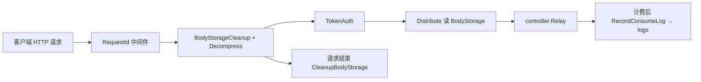
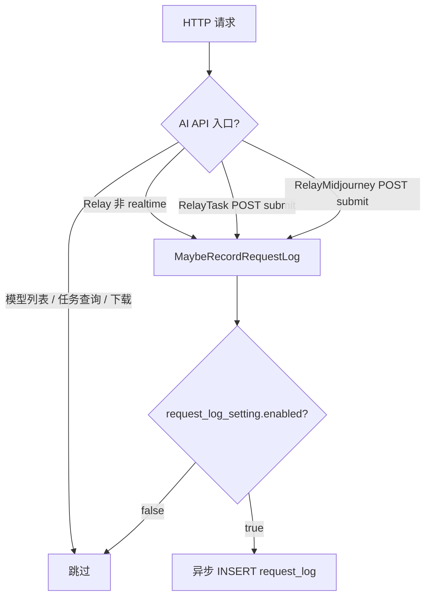
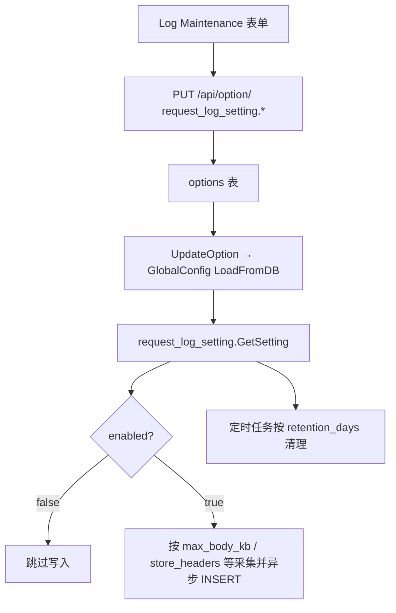
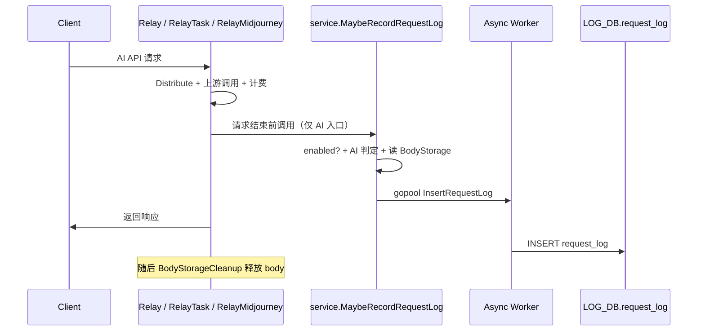
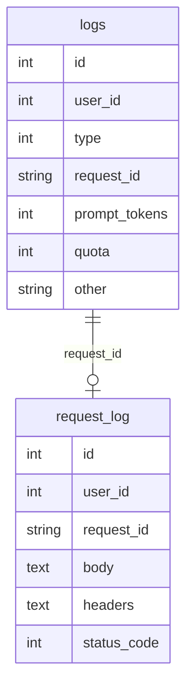

# API 请求完整内容持久化 · 开发设计文档

> **状态**：**已确认，待实现** · **范围**：Relay 层 + `request_log` 表 + **系统设置 UI（Log Maintenance）**（无 request_log 浏览 UI）  
> **说明**：评审结论见 §11；全部策略项在 **系统设置 → Log Maintenance** 配置（§6）。

---

## 1. Executive Summary

### 背景与问题

当前系统通过 **`logs` 表**记录 API 调用的计费与审计元数据（模型、token 用量、额度、倍率等），但**不保存用户提交的完整请求体**（prompt、messages、图片 base64 等）。排查问题、合规审计、争议对账时，管理员只能看到摘要信息，无法还原「用户当时到底发了什么」。

### 目标方案

新增数据库表 **`request_log`**，在用户每次调用 **AI API**（模型推理、生成、嵌入、图像/音视频生成等）时，将**客户端原始 HTTP 请求内容**写入该表，并与现有 `request_id` 关联。**不记录**模型列表、任务查询、资源下载等非 AI 调用。

### 成功标准

| KPI | 目标 |
|-----|------|
| 完整性 | **AI API** 成功/失败请求均写入（开启且未超 body 上限时）；非 AI 路由零写入 |
| 非阻塞 | 持久化为**异步写入**，不增加 P99 响应延迟超过 5ms（不含 DB 排队） |
| 可关联 | 同一请求在 `request_log.request_id` 与 `logs.request_id` 可 join |
| 可运维 | 开关、保留天数、body 上限等均在 **系统设置 UI** 可配（默认关闭 / 保留 7 天 / body 1024KB）；超大 body 仅元数据 |
| 跨库兼容 | SQLite / MySQL ≥ 5.7.8 / PostgreSQL ≥ 9.6 三库可用 |

---

## 2. 现状梳理

### 现有相关表

| 表 | 用途 | 是否存完整请求 |
|----|------|----------------|
| `logs` | 消费/错误/充值/审计日志 | 否；`content` 为计费说明，`other` 为 JSON 元数据 |
| `quota_data` | 按小时聚合用量（数据看板） | 否 |
| `tasks` | 异步任务（视频/Suno 等） | 部分；`properties.input` + `data` 为任务级数据 |
| `midjourneys` | MJ 任务 | 部分；`prompt` 等字段 |

### 现有请求体处理链路



关键点：

- 请求体通过 `common.GetBodyStorage(c)` 统一缓存（内存或磁盘，`MaxRequestBodyMB` 默认 128MB）。
- `middleware/distributor.go` 在选渠道前已读取 body；Relay handler 可重复 `Seek(0)` 复用。
- **`BodyStorageCleanup` 在 `c.Next()` 后销毁 body**，因此持久化必须在 cleanup 之前完成（复制 body 字节或异步引用拷贝）。

### 现有日志库

- `LOG_DB`：配置了 `LOG_SQL_DSN` 时使用独立库，否则与主库 `DB` 相同（`model/main.go`）。
- 目前 `migrateLOGDB()` 仅迁移 `Log` 模型。

---

## 3. 需求范围

### 3.1 In Scope（本期）

1. 新建 **`request_log`** 表及 GORM 模型 `model.RequestLog`。
2. 仅对 **AI API 请求**（见 §3.3–§3.4）在请求结束时持久化：
   - HTTP Method、Path、Query（可选）
   - 请求头（**脱敏后**）
   - **完整请求体**（客户端收到的原始 body，非上游转换后 body）
   - 关联字段：`user_id`、`token_id`、`username`、`token_name`、`model_name`、`group`、`channel_id`、`request_id`
   - 响应状态码 `status_code`（便于过滤失败请求；**不存响应 body**）
3. **`request_log_setting` 系统配置**：开关、body 上限、保留天数、headers 策略等写入 `options` 表，在 **系统设置 → 运营 → Log Maintenance** 统一编辑（与 `LogConsumeEnabled` 同页；实现模式对齐 `perf_metrics_setting`，见 §6）。
4. 异步写入（`gopool`），写入失败仅 `SysLog`，不影响 API 响应。
5. 定时清理过期记录（读取 `request_log_setting.retention_days`，默认 7 天；见 §9）。
6. v1 **不提供** request_log 列表/详情浏览 UI 与 HTTP 查询 API；排查时直连 DB / SQL。

### 3.2 Non-Goals（本期不做）

- **不存储响应 body**（v1 仅存 `status_code`；响应内容另开 v2 需求）。
- 不改造 **`logs` 表**结构；两表通过 `request_id` 逻辑关联，不做 DB 外键。
- **不提供** request_log **浏览/检索** UI 与 `GET /api/log/request`（v2 再议）。
- **提供** 系统配置页 **`request_log_setting` 表单**（Default 主题「日志维护」区块）：开关、保留天数、body 上限等。
- 不对 **非 AI API**（模型列表、任务轮询、文件/视频下载、Dashboard API 等）写 `request_log`。
- **WebSocket Realtime**（`/v1/realtime`）：v1 **完全排除**。
- **Playground**（`UserAuth` + `Distribute`）：**不纳入**。
- 不对 body 做 gzip 二次压缩存储（v1 明文 TEXT；超大 body **不存 body，仅元数据**）。

### 3.3 AI API 范围（**收录**）

**定义：** 会触发上游 **AI 模型推理 / 生成 / 嵌入 / 审核** 的 Token 鉴权接口；以客户端提交的 prompt、messages、input 等为主要 payload。

| 入口 | 典型路径 / 处理器 | RelayFormat / 说明 |
|------|-------------------|-------------------|
| Chat / Completion | `POST /v1/chat/completions`、`/v1/completions` | `openai` |
| Claude | `POST /v1/messages` | `claude` |
| Responses | `POST /v1/responses`、`/v1/responses/compact` | `openai_responses` / compaction |
| Embedding | `POST /v1/embeddings`、`/v1/engines/:model/embeddings` | `embedding` |
| Audio | `POST /v1/audio/transcriptions`、`translations`、`speech` | `openai_audio` |
| Image | `POST /v1/images/generations`、`/images/edits`、`/edits` | `openai_image` |
| Rerank | `POST /v1/rerank` | `rerank` |
| Moderation | `POST /v1/moderations` | `openai` |
| Gemini | `POST /v1/models/*`、`POST /v1beta/models/*` | `gemini` |
| 视频生成 | `POST /v1/videos`、`/v1/video/generations`、`/kling/v1/videos/*`（submit）、`POST jimeng/` | `task`（`RelayTask` 提交） |
| Suno | `POST /suno/submit/:action` | `task` |
| Midjourney | `POST /mj/submit/*`、`/insight-face/swap`、`/submit/upload-discord-images` 等 **提交类** | `mj_proxy` |

以上均走 `controller.Relay()` 或 **`RelayTask` / `RelayMidjourney` 的 POST 提交**，且已通过 `TokenAuth` + `Distribute`（或等效鉴权）。

### 3.4 明确排除（**不收录**）

| 类别 | 示例 | 原因 |
|------|------|------|
| 模型元数据 | `GET /v1/models`、`GET /v1/models/:model`、`GET /v1beta/models` | 非 AI 推理，无生成 payload |
| 任务查询 / 轮询 | `GET /v1/videos/:id`、`RelayTaskFetch`、`GET /suno/fetch/*`、`GET /mj/task/:id/fetch` | 仅查状态，非 AI 请求 |
| 资源下载 | `GET /v1/videos/:task_id/content`、`GET /mj/image/:id` | 静态资源，非 AI 调用 |
| WebSocket | `GET /v1/realtime` | v1 排除 |
| Playground | `POST /pg/chat/completions` | 非 Token API |
| Dashboard | `/api/*` Session 接口 | 管理端 |
| 未实现桩 | `RelayNotImplemented` 路由 | 无实际 AI 调用 |
| 上游回调 | MJ `notify` 等 | 非用户发起 |

**说明：** 此前确认的「GET 无 body 仍写元数据」**不适用于**上表排除项——这些路由 **一律不写** `request_log`；AI API 以 POST 为主，正常均有 body。

### 3.5 判定与挂载（实现）

**不推荐** 对整个 `RouteTag("relay")` 挂中间件（会误收模型列表、任务查询）。

**推荐：** 在 AI 入口 **显式调用** `service.MaybeRecordRequestLog(c)`（内部再判断 `request_log_setting.enabled`）：

| 调用点 | 条件 |
|--------|------|
| `controller.Relay()` | 所有 `RelayFormat`，**除** `openai_realtime` |
| `controller.RelayTask()` | 仅 **POST 提交**（非 `RelayTaskFetch`） |
| `controller.RelayMidjourney()` | 仅 **POST** 且 path 含 `/submit/`、`/insight-face/` 等提交语义（**非** GET fetch / image） |

可选：在 `Relay()` 入口 `c.Set("relay_format", relayFormat)`，写入 `request_log.relay_format` 便于审计。



---

## 4. 数据模型设计

### 4.1 表名

固定为 **`request_log`**（GORM：`func (RequestLog) TableName() string { return "request_log" }`）。

### 4.2 字段定义（建议）

| 字段 | 类型 | 说明 |
|------|------|------|
| `id` | int / bigint PK | 自增主键 |
| `created_at` | bigint | Unix 秒，索引 |
| `user_id` | int | 索引 |
| `username` | varchar(64) | 冗余，便于检索 |
| `token_id` | int | 索引，默认 0 |
| `token_name` | varchar(64) | 冗余 |
| `request_id` | varchar(64) | **与 logs 对齐**，索引 `idx_request_log_request_id` |
| `method` | varchar(16) | GET/POST/… |
| `path` | varchar(512) | `URL.Path`，索引可选 |
| `query` | text | Raw query string，可为空 |
| `content_type` | varchar(128) | `Content-Type` |
| `headers` | text | JSON 对象，**已脱敏** |
| `body` | mediumtext / text | **完整请求体**（未超限时）；超限时为空，见 §5.3 |
| `body_size` | int | 原始请求体字节长度（即使未入库也记录真实 size） |
| `body_omitted` | bool | 是否因超过 `request_log_setting.max_body_kb` **未存 body**（仅元数据） |
| `model_name` | varchar(128) | 从 context 或 body 解析，索引 |
| `group` | varchar(64) | 计费用分组，注意 PostgreSQL 引号 |
| `channel_id` | int | 选渠后写入，未选渠为 0 |
| `relay_format` | varchar(32) | 如 `openai`、`claude`（来自 context，可选） |
| `status_code` | int | HTTP 响应状态码 |
| `ip` | varchar(64) | 仅当用户开启 `RecordIpLog` 时写入（与 logs 一致） |

**索引建议**：

- `(user_id, created_at DESC)`
- `(token_id, created_at DESC)`
- `(request_id)` UNIQUE 可选 — **不建议 UNIQUE**（重试/网关内部或会产生重复 request_id 时需确认；当前 `RequestId` 为 UUID，单次请求唯一，可用普通索引）

**存储引擎注意（已确认）**：

- 遵循 Rule 2：`headers`、`query` 使用 **TEXT**；`body` 在 MySQL 使用 **`MEDIUMTEXT`（16MB）**，PostgreSQL / SQLite 使用 **TEXT**。
- **选用 MEDIUMTEXT 而非 LONGTEXT 的理由**：默认 `max_body_kb=1024`，超限 body 不落库；在限制内的 multipart/二进制原样存储，16MB 足够。
- GORM：`body` 字段 tag 为 `gorm:"type:mediumtext"`（MySQL 迁移生效；PG/SQLite 等价 text）。

### 4.3 存放哪个数据库

**推荐**：与 `logs` 相同，使用 **`LOG_DB`**（`LOG_SQL_DSN` 独立日志库）。

理由：请求体体积远大于 `logs`，与业务主库分离，便于备份、清理、扩容。

迁移：扩展 `migrateLOGDB()` → `LOG_DB.AutoMigrate(&RequestLog{})`。

---

## 5. 「完整请求内容」语义

### 5.1 存储内容定义

**「完整」= 网关收到的客户端原始 HTTP 请求**，以 `common.GetBodyStorage(c)` 在 **`BodyStorageCleanup` 之前**读取的字节为准：

- **Pass-through 模式**：即客户端 JSON，与上游一致。
- **非 Pass-through**：仍为**客户端提交 body**，不是 `ConvertClaudeRequest` / `ApplyParamOverride` 之后的发 upstream body。

这样与「用户调用了什么」语义一致；若需同时存 upstream body，列为 v2（`upstream_body` 字段）。

### 5.2 非 JSON / 大体积 / 二进制（已确认）

| Content-Type | 策略 |
|--------------|------|
| `application/json` | 原样 UTF-8 存入 `body`（未超限时） |
| `application/x-www-form-urlencoded` | 原样存入 |
| `multipart/form-data` | **原样存入**（含 boundary 与文件二进制，未超限时） |
| 其他二进制 / `audio/*` / `image/*` | **原样字节**写入 `body`（未超限时；不做 Base64 转换） |
| 无 body 的 AI POST（极少见） | 仍写元数据；`body=""`，`body_size=0` |

### 5.3 超大 body 与跳过（已确认）

配置 **`request_log_setting.max_body_kb`**（默认 **1024 KB**，可在系统设置修改，可独立于 `MaxRequestBodyMB`）：

- **未超过上限**：`body` 存完整内容，`body_omitted=false`。
- **超过上限**：**不存 body**，仅写元数据：`body=""`，`body_size=真实长度`，`body_omitted=true`（**不截断、不留前缀**）。
- **`max_body_kb=0`**：所有请求均只存元数据（`body` 恒为空，`body_omitted=true`）。
- **`request_log_setting.enabled=false`**：不写表。

---

## 6. 配置项（系统设置 UI · v1 全部走 `options` 表）

与 **`perf_metrics_setting`** 相同模式：新增 `setting/request_log_setting` 模块，注册到 `config.GlobalConfig`，选项以 **`request_log_setting.<field>`** 为 key 存入 `options` 表；`InitOptionMap` 通过 `ExportAllConfigs()` 自动导出，**不提供**对应 env 变量（避免双源）。

### 6.1 配置字段

| Option Key | JSON 字段 | 类型 | 默认值 | 说明 |
|------------|-----------|------|--------|------|
| `request_log_setting.enabled` | `enabled` | bool | `false` | 是否写入 `request_log` |
| `request_log_setting.max_body_kb` | `max_body_kb` | int | `1024` | 单条 body 上限（KB）；超限**只存元数据**；`0`=始终只存元数据 |
| `request_log_setting.retention_days` | `retention_days` | int | `7` | 自动清理保留天数；`0`=不自动清理 |
| `request_log_setting.store_headers` | `store_headers` | bool | `true` | 是否持久化 headers JSON |
| `request_log_setting.redact_headers` | `redact_headers` | string | `Authorization,Cookie,x-api-key,x-goog-api-key` | 脱敏 header 名列表（逗号分隔） |

运行时读取：`request_log_setting.GetSetting()`（与 `perf_metrics_setting.GetSetting()` 一致）。

### 6.2 后端改动

| 文件 | 改动 |
|------|------|
| `setting/request_log_setting/config.go` | 定义 struct、`Register("request_log_setting")`、`GetSetting()` |
| `model/option.go` | 随 `ExportAllConfigs` 自动注册；`LoadFromDB` / `UpdateOption` 热更新 |
| `service/request_log.go` | 读取 `GetSetting()` 判断 enabled、max_body_kb、store_headers、redact_headers |
| `model/request_log.go` / 清理任务 | 读取 `retention_days` 执行 `DeleteOldRequestLog` |

**不提供** `REQUEST_LOG_*` 环境变量。

### 6.3 前端（Default 主题 · Log Maintenance）

扩展 **`log-settings-section.tsx`**：在现有 `LogConsumeEnabled` 开关与「清理 history logs」之间，增加 **「API Request Log」** 子区块（布局参考 `performance-section.tsx` 中 `perf_metrics_setting` 表单项）。

| 控件 | 绑定字段 | 行为 |
|------|----------|------|
| Switch | `request_log_setting.enabled` | 总开关 |
| Number | `request_log_setting.max_body_kb` | `min=0`；`enabled=false` 时 disabled |
| Number | `request_log_setting.retention_days` | `min=0`；说明「0 = 不自动清理」 |
| Switch | `request_log_setting.store_headers` | `enabled=false` 时 disabled |
| Input / Textarea | `request_log_setting.redact_headers` | 逗号分隔；`enabled=false` 时 disabled |

**类型与默认值：**

| 文件 | 改动 |
|------|------|
| `web/default/.../types.ts` | `OperationsSettings` 增加 5 个 `request_log_setting.*` 字段 |
| `web/default/.../operations/index.tsx` | 默认值与 §6.1 一致 |
| `web/default/.../operations/section-registry.tsx` | 向 `LogSettingsSection` 传入 `request_log_setting` 默认值 |
| `web/default/.../log-settings-section.tsx` | 表单 schema、批量保存（变更项逐条 `updateOption`，对齐 Performance 节） |
| `web/default/src/i18n/locales/*.json` | 区块标题与各字段说明 |

**保存方式：** 复用 `useUpdateOption()` → `PUT /api/option/`，key 为 `request_log_setting.enabled` 等；仅提交相对 baseline **有变更** 的 key。

**页面位置：** `系统设置 → Operations → Log Maintenance`（`/system-settings/operations/logs`）。

**UI 文案建议（i18n 英文源字符串）：**

| 用途 | 英文（示例） |
|------|----------------|
| 区块标题 | `API request log` |
| 开关 | `Record API request bodies` |
| 开关说明 | `Persist AI API client request payloads to request_log. Does not include model listing or task polling. May contain sensitive data.` |
| body 上限 | `Max request body size (KB)` |
| body 上限说明 | `Requests larger than this store metadata only. Set to 0 to never store bodies.` |
| 保留天数 | `Retention days` |
| 保留说明 | `0 means request logs are kept until manually cleaned.` |
| 存 headers | `Store request headers` |
| 脱敏列表 | `Headers to redact` |

**Classic 主题：** v1 不改造。

### 6.4 配置数据流



---

## 7. 架构与写入时机

### 7.1 推荐实现：AI 入口显式采集（非全量 Relay 中间件）

在 **`BodyStorageCleanup` 之前** 拷贝 body；由 AI 处理器在返回前触发 `service.MaybeRecordRequestLog(c)`：



**调用位置（见 §3.5）：**

- `controller/relay.go` — `Relay()` 末尾（`defer` 或统一出口），排除 `RelayFormatOpenAIRealtime`
- `controller/relay.go` — `RelayTask()` 提交分支
- `controller/relay.go` — `RelayMidjourney()` POST 提交分支

**不在** `modelsRouter`、`RelayTaskFetch`、MJ GET、video content proxy 等路径调用。

### 7.2 代码分层

| 层 | 职责 |
|----|------|
| `service/request_log.go` | `MaybeRecordRequestLog`、`IsAIAPIRequest` 判定、脱敏、超限、异步写入 |
| `controller/relay.go` | 在 AI 入口调用 `MaybeRecordRequestLog` |
| `model/request_log.go` | 模型、`InsertRequestLog`、`DeleteOldRequestLog` |

### 7.3 Context 字段来源

| 字段 | 来源 |
|------|------|
| `user_id`, `username` | `TokenAuth` / `c.GetInt("id")` |
| `token_id`, `token_name` | context |
| `model_name`, `group` | `ContextKeyOriginalModel`, `ContextKeyUsingGroup` |
| `channel_id` | `ContextKeyChannelId`（Distribute 之后才有） |
| `request_id` | `common.RequestIdKey` |
| `relay_format` | 可在 `controller.Relay` 入口 `c.Set`，或中间件从 path 推断 |

**注意**：须在 **Distribute 完成之后** 调用，以便 `channel_id`、`model_name` 等 context 已就绪；可在 `Relay()` 各 handler 返回前的统一 defer 中执行。

---

## 8. 安全与合规

### 8.1 敏感数据

完整 body 可能含：

- 用户 prompt、PII、商业机密
- Base64 图片/音频
- 嵌入在 JSON 里的 API Key（少见但可能）

**必须**：

1. Header 脱敏（Authorization、Cookie、各类 `*-key`）。
2. 文档与**系统设置开关说明**明确：开启后数据库含敏感数据，需限制 DB 访问权限、加密备份。
3. v1 无 HTTP 查询接口；DB 访问需运维权限控制。v2 若增加 API，须 **`AdminAuth`**。

**可选 v1.1**：对 body JSON 中 `api_key` 等字段递归脱敏（与 `CheckSensitive` 无关，独立配置）。

### 8.2 与现有 `RecordIpLog` 对齐

仅当 `user.setting.record_ip_log == true` 时写入 `ip`，与 `model/log.go` 行为一致。

---

## 9. 清理与容量规划

### 9.1 定时任务

参考 `controller/log.go` + `model.DeleteOldLog`：

- 新增 `model.DeleteOldRequestLog(ctx, beforeTs, batchSize)`。
- 清理任务读取 **`request_log_setting.GetSetting().RetentionDays`**；`0` 则跳过。
- 在现有日志清理 cron/接口中**一并调用**（与 `DeleteOldLog` 同入口），或 Admin 手动触发。

### 9.2 容量估算（运维参考）

假设：平均 body 4KB，10 万请求/天 → ~400MB/天；7 天 ~2.8GB。  
若含图片 base64，单条可达 MB 级，应在系统设置中调低 **`max_body_kb`** 或 **`retention_days`**。

---

## 10. 数据检索（v1）

v1 **不提供** HTTP 查询 API 与管理端 UI。运维/开发通过 SQL 直连 `LOG_DB` 检索。

### 10.1 按 request_id 关联 logs

```sql
SELECT l.*, r.body, r.path
FROM logs l
LEFT JOIN request_log r ON l.request_id = r.request_id
WHERE l.request_id = ?;
```

跨 `LOG_DB` 与 `DB` 同库时可直接 join；**异库时**应用层两次查询。

---

## 11. 已确认决策

| 编号 | 决策 |
|------|------|
| **A1** | **默认关闭**：`request_log_setting.enabled=false`（升级零影响） |
| **A2** | **超大 body 只存元数据**：超限时不写 `body`，设 `body_omitted=true`，不截断 |
| **A3** | **multipart / 二进制原样存**（在 `max_body_kb` 限制内） |
| **A4** | AI API 以 POST 为主；**模型列表 / 任务查询等 GET 不收录**（非「写空 body 元数据」） |
| **A5** | **WebSocket Realtime**：v1 **完全排除** |
| **A6** | **Playground**：**不纳入** |
| **A7** | v1 **仅存 `status_code`**，不存响应 body |
| **A8** | v1 **不需要** request_log 浏览/检索 UI；**需要** Log Maintenance 系统配置表单 |
| **A9** | MySQL 使用 **`MEDIUMTEXT`**（16MB；配合 body 上限足够） |
| **A10** | **默认保留 7 天**；`retention_days` 在系统设置 UI **可配置** |
| **A11** | 配置项放在 **Log Maintenance**，与 `LogConsumeEnabled` 同页 |
| **A12** | **保留天数、body 上限、headers 策略等均在系统设置 UI 操作**（不用 env） |
| **A13** | **`request_log` 仅存储 AI API 请求**；模型列表、任务查询、资源下载等 **不存储**（**评审补充**） |

---

## 12. 实现清单（确认后执行）

### 12.1 后端

| 序号 | 文件 | 改动 |
|------|------|------|
| 1 | `model/request_log.go` | 新增模型与 CRUD |
| 2 | `model/main.go` | `migrateLOGDB()` 增加 `RequestLog` |
| 3 | `setting/request_log_setting/config.go` | 配置模块 + `GetSetting()` |
| 4 | `service/request_log.go` | `MaybeRecordRequestLog`、`IsAIAPIRequest`、采集、异步写入 |
| 5 | `controller/relay.go` | `Relay` / `RelayTask` / `RelayMidjourney` 内调用 |
| 6 | `model/option.go` | 随 GlobalConfig 自动同步 |
| 7 | `controller/log.go` 或定时任务 | 过期清理（读 `retention_days`） |

### 12.2 前端（Default 主题）

| 序号 | 文件 | 改动 |
|------|------|------|
| 1 | `web/default/.../types.ts` | 5 个 `request_log_setting.*` 字段 |
| 2 | `web/default/.../operations/index.tsx` | 默认值 |
| 3 | `web/default/.../log-settings-section.tsx` | API Request Log 子表单 + 批量保存 |
| 4 | `web/default/.../operations/section-registry.tsx` | 传入默认值对象 |
| 5 | `web/default/src/i18n/locales/*.json` | 文案翻译 |

### 12.3 测试

| 类型 | 内容 |
|------|------|
| 单元测试 | header 脱敏、body 超限省略、GET 空 body 元数据 |
| 集成测试 | SQLite 插入；`GET /v1/models` **无记录**；`POST /v1/chat/completions` **有记录** |
| 手工 | 开启 setting → AI POST 有记录；任务 fetch GET 无记录 |

### 12.4 文档

- 运维说明：磁盘、备份、合规、与 `LOG_SQL_DSN` 建议

---

## 13. 风险与缓解

| 风险 | 影响 | 缓解 |
|------|------|------|
| 磁盘快速增长 | DB 满、备份成本 | 默认关闭；保留期；body 上限 |
| 写入延迟堆积 | 高 QPS 时 goroutine/DB 压力 | 异步 + 可选队列限流；写入失败丢弃并计数 |
| 敏感数据泄露 | 合规 | Admin 权限；header 脱敏；运维文档 |
| 与 BodyStorage 竞态 | 数据不完整 | 在 Cleanup 前拷贝 bytes |
| MySQL TEXT 64KB 限制 | 大 JSON 写入失败 | MEDIUMTEXT + 测试 |

---

## 14. 版本规划建议

| 版本 | 内容 |
|------|------|
| **v1.0** | `request_log` 表 + 异步写入 + **Log Maintenance 完整配置 UI** + 按 `retention_days` 清理 |
| **v1.1** | Admin 查询 API |
| **v2.0** | request_log 浏览 UI；`response_log`；upstream body；WS 帧日志 |

---

## 15. 附录：与 `logs` 表关系示意



---

**文档版本**：v1.3（已确认，仅 AI API + Log Maintenance 配置 UI） · **下一步**：按 §12 实现。
